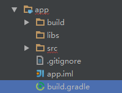

## OpenCV简介
OpenCV的全称是：Open Source Computer Vision Library。OpenCV是一个基于BSD许可（开源）发行的跨平台计算机视觉库，可以运行在Linux、Windows、Android和Mac OS操作系统上。它轻量级而且高效——由一系列 C 函数和少量 C++ 类构成，同时提供了Python、Ruby、MATLAB等语言的接口，实现了图像处理和计算机视觉方面的很多通用算法。   
GITHUB地址：https://github.com/opencv/opencv.git   
官方网站：http://opencv.org/downloads.html   
各种编译好的包下载地址：https://sourceforge.net/projects/opencvlibrary/files/
## C++ 项目Xcode的配置
OpenCV的示例代码都是用C++写的，在iOS调用比较麻烦，需要各种数据转换，这里提供一个Xcode中新建C++项目直接使用示例代码的一个方式。
1）安装OpenCV
```
brew install homebrew/science/opencv3
```
用homebrew安装比较快捷而且方便管理，也可以选择直接编译源码的方式。   
2）Xcode新建Command Line类型的项目   
3）add files to project，comman+shit+g调出路径输入框/usr/local/opt/opencv3/lib，把需要的模块拉上，注意不要勾上copy items if need   
4）可以使用OpenCV了，copy示例代码到main.m文件，这是demo   

## iOS的编译使用
### 编译
1）下载opencv源文件，安装编译环境CMake（brew install cmake）   
2）cd 根目录，执行了ln命令
```
cd /
sudo ln -s /Applications/Xcode.app/Contents/Developer Developer
```
3）编译opencv for ios
```
cd ~/<my_working_directory>
python opencv/platforms/ios/build_framework.py ios
```
4）如果需要增加contrib库
```
python opencv/platforms/ios/build_framework.py ios -- contrib <contrib_directory>
```
5）如果不想去编译的可以去官网直接编译好的库文件（看简介的链接）
### Xcode的配置
在iOS项目中引用，需要注意有两个地方，一是OpenCV的头文件需要放在OC其他库的前面，二是使用了OpenCV的代码的文件后缀要改成.mm。   
1）将编译好的opencv2.framework文件导入项目中   
2）新建pch文件，引入OpenCV的头文件   
```
#import <Availability.h>

#ifndef __IPHONE_5_0

    #warning "This project uses features only available in iOS SDK 5.0 and later."

#endif

#ifdef __cplusplus

    #import <opencv2/opencv.hpp>

#endif

#ifdef __OBJC__

    #import <UIKit/UIKit.h>

    #import <Foundation/Foundation.h>

#endif
```
说明一下为何在 PCH 文件中引入 OpenCV 的头文件我们需要多加`#ifdef __cpluseplus`这一部分呢？这是因为 PCH 文件是一个会被所有的文件引入的头文件，而我们又希望 `#import <opencv2/opencv.hpp>`这部分只会被一些 C++实现文件编译，所以我们加上`#ifdef __cpluseplus`来表示这是 C++ 文件才会编译的，除了`#ifdef __cpluseplus`，还有`#ifdef __OBJC__`这样的宏来说明编译规则（按照 OC 文件编译），这样的宏多出现于一些会被多种类型的实现文件引用的头文件中。   
3）设置编译参数

4）可以使用OpenCV了，demo。

## Android的编译使用
### 编译
1）下载opencv源文件，安装编译环境CMake、Ninja、Ant
```
brew install cmake
brew install ninja
brew install ninja
```
2）检测和修改build_sdk.py文件（opencv目录/platforms/android）（修改编译器、最低版本等等）

跟android NDK编译工具对应上，比如4.8改成4.9

3）运行编译脚本，build_sdk.py文件
```
python build_sdk.py <output-dir> <opencv-src-dir> --sdk_path=<android-sdk-path> --ndk_path=<ndk-path> --extra_modules_path=<opencv-contrib-path>
```
output-dir ： 编译后的包输出的目录   
opencv-src-dir ： opencv源码下载的目录   
android-sdk-path ： android SDK的目录   
ndk-path ： android NDK的目录   
例如 ： ./platforms/android/build_sdk.py ./ ./ --ndk_path /Users/Netease/Library/Android/sdk/ndk-bundle --sdk_path /Users/Netease/Library/Android/sdk   
4）如果不想去编译的可以去官网直接编译好的库文件（看简介的链接）
### Android项目AndroidStudio的配置
这个一个不用安装opencvmanager就能跑例子的项目配置教程，在这里主要是整理了一下，原文来自http://jingyan.baidu.com/article/60ccbceb53533364cab197db.html，这里主要是留着记录，可以继续往下看或者看网上原文。   
这里用的是最新的包opencv-3.2.0-android-sdk。
#### 1、下载OpenCV sdk for Android
1）建议放到比较正式的目录方便管理（我放的地址/Users/Netease/Library/Android）

#### 2、新建项目
1）新建项目项目，取名为Opencvtest（名字随便取）   
2）Minimum SDK 选择 API 19：Android 4.4 （KitKat）   
3）选择Empty Activity   


#### 3、Import Module
1）Android Studio菜单-->File-->New-->Import Module   
2）选择OpenCV-android-sdk/sdk/java   
3）Module name: Android studio会自动填充这项为openCVLibrary310 ，不用管它.   
4）点击下一步，会出现三个复选框，都选上，点击Finish   


#### 4、Add Dependency
1）File-->Project Structure   
2）左边Modules栏下选择app   
3）在右边上面一栏中选择Dependencies   
4）点击右边栏中的“＋”，选择第三个Module Dependency   
5）点击ok退出，然后再点击ok退出   
    
   
   
   
   
   

#### 5、修改gradle
1）将视图由Android切换到Project，如图所示   
2）点击app，打开app根目录下的build.gradle文件，记下   
compileSdkVersion   
buildToolsVersion   
minSdkVersion   
targetSdkVersion   
后面的数值   
3）点击openCVLibrary310,打开根目录下的build.gradle文件，把文件中   
compileSdkVersion   
buildToolsVersion   
minSdkVersion   
targetSdkVersion   
后的数值改成app中一样的   
4）点击上方Gradle project sync一行中的Try Again   
    
   
   
    
   
#### 6、复制opencv的libs到项目中
1）把OpenCV sdk for Android文件下F:\OpenCV-android-sdk\sdk\native下的libs文件夹拷贝到你的安卓项目下，即Opencvtest\app\src\main下面，并且将libs改名为jniLibs   
2）此时前期准备工作就完成了，接下来可以用opencv中程序测试下   
3）打开你的主活动MainActivity.java文件，记下包名，我的是package    com.xiaoma.opencvtest;，则我的包名就是com.xiaoma.opencvtest   
    
   
   
#### 7、复制opencv的res到项目中
1）将`OpenCV-android-sdk\samples\image-manipulations\res`中的三个文件（如图所示），拷贝到你的安卓项目`Opencvtest\app\src\main\res`下（拷贝前先将此目录下的同名的三个文件删掉   
2）将`OpenCV-android-sdk\samples\image-manipulations`中的`AndroidManifest.xml`文件，拷贝到你的安卓项目`Opencvtest\app\src\main`下替换   
3）将`OpenCV-android-sdk\samples\image-manipulations\src\org\opencv\samples\imagemanipulations`中的`ImageManipulationsActivity.java`文件，
拷贝到你的安卓项目`Opencvtest\app\src\main\java\com\xiaoma\opencvtest`下，并且把原来的`MainActivity.java`文件删掉。其中`\com\xiaoma\`这段根据每个人的包名不同会不一样。
   
#### 8、复制opencv的例子代码到项目中
1）在Android Studio中打开`ImageManipulationsActivity.java`，`AndroidManifest.xml`
2）把文件中的包名，换成第六步骤中你记下的包名   
3）`AndroidManifest.xml`文件下的`uses-sdk android:minSdkVersion`的值改成第五步骤中记下的值   
4）注意这一步在改`AndroidManifest.xml`文件中的包名时不要把原来的“”给粘贴没了。
#### 9、注意
有些手机运行时可能会弹出
```
It seems that you device does not support camera(or it is locked).Application will be closed.
```
这时候打开手机应用权限管理，找到该程序应用，把它的相机的权限改为允许就可以了。
#### 7. 本文用到的demo
