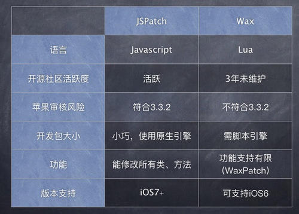
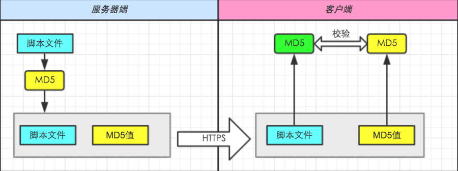
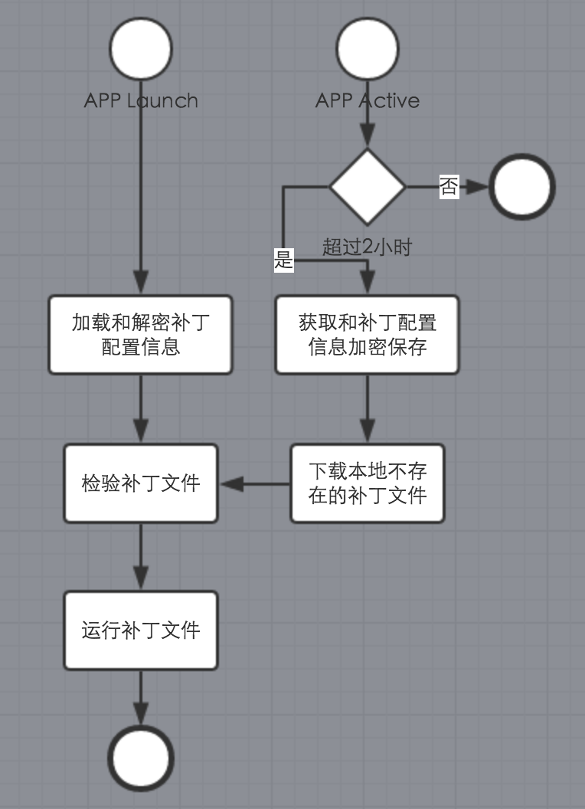

## 客户端的痛
在线上APP发布以后，最痛苦的事情莫过于发现紧急的BUG，一旦发现马上加班开发的改BUG，测试通过然后上传新包。前面几步都还好说，关系到都是自己人，加班加点是免不了的了。对于iOS客户端来说，上传新包之后就苹果审核，过去来说一周是正常的，现在审核提速了，也得一两天，审核之后用户需要下载整个包覆盖安装，用户也不会及时地去更新，整个流程中耗费时间长但是效果极差。为了快速地修复iOS App的线上问题，需要引进一个热修复的方案。

## JSPatch与Wax/WaxPatch对比
iOS热修复方案在很早之前就已经出现在游戏领域，毕竟游戏的完整安装包经常是百兆以上，每次为一个BUG下载整个包不现实，WaxPatch正是为此出现，比如当年风靡一时的《Angry Birds》就是使用 Wax Lua 开发的，还有JSCocoa等。下图对了一下JSPatch和 WaxPatch优缺点，得出JSPatch更适合引进成为APP热修复方案的工具。

## JSPatch的简介和实现原理
JSPatch诞生于2015年5月，是腾讯广研高级iOS开发@bang的个人项目，放到github开源至今获得了43000多个star和700多fork。该项目一直在持续开发中，同时推出一些支持产品，如JSPatch 代码自动转换工具 和 JSPatch 服务平台。   
Github链接：https://github.com/bang590/JSPatch   
OC和JS自动转换：http://bang590.github.io/JSPatchConvertor/   
能做到通过JS调用和改写OC方法最根本的原因是 Objective-C 是动态语言，OC上所有方法的调用/类的生成都通过 Objective-C Runtime 在运行时进行，我们可以通过类名/方法名反射得到相应的类和方法，也可以替换某个类的方法为新的实现，还可以新注册一个类，为类添加方法。关于Objective-C 对象模型和动态消息发送的原理详细可看看这篇文章http://blog.csdn.net/kesalin/article/details/6689226。  
理论上你可以在运行时通过类名/方法名调用到任何Object C方法，替换任何类的实现以及新增任意类。所以 JSPatch 的基本原理就是：启动一个JS语言的解析引擎，通过 Runtime 接口调用和替换 Object C 方法的实现。更详细可以看JSPatch作者写的 https://github.com/bang590/JSPatch/wiki/JSPatch-%E5%AE%9E%E7%8E%B0%E5%8E%9F%E7%90%86%E8%AF%A6%E8%A7%A3 原理详解。通过这个原理基本可以实现新增类、新增类的方法或者替换类的方法、支持调用Object C方法、Block、self、特殊类型等等。
## 热修复实施方案
JSPatch仅仅是一个工具，用于补丁包加载到应用从而修复BUG，但是APP是安装到每个用户的手机上，如果将补丁包下发到每个用户安装的APP的上，还需围绕JSPatch搭建一个前后端的使用平台，平台方案包含补丁版本控制、安全策略、客户端策略、异常处理四个方面，从而保证补丁包安全及时地下发到每一安装了APP的用户手机上。
### 补丁版本控制
补丁包是使用JS代码，仅仅是为修复BUG而写，并不能真正做开发源码，所以每一个使用JSPatch修复的BUG，后面版本都会用Object-C修复，补丁JS代码不会存留超过一个版本。需要做到有多个补丁同时被某个版本按顺序加载，补丁后一个版本可以是修复新BUG，或是覆盖上一个补丁的代码。
补丁版本应该如下图所示。   
   
### 安全策略
补丁包包含一些可执行的代码，这是比较敏感的数据，不应该直接暴露，需要考虑在传输和保存加入加密保护。服务器端和客户端的数据传输使用HTTPS，下载后通过MD5校验完整性，在客户端加密保存补丁包时加密。

### 客户端策略
在APP启动后，首先启动JSPatch的引擎，将已经下载的补丁包校验后加载运行，实时地替换调有问题的ObjectC代码实现。客户端需要定时2个小时去检查服务器端是否有新的补丁包，保证实时性，下载后马上校验后加载运行并保存以备下次启动首先被运行。补丁包校验包含MD5完整性和根据文件名确认是否适用于当前系统。整个流程如下图所示

### 异常处理
客户端加载patch后可能会出现两种crash情况的问题。1、是在启动加载时发生；2、是在触发某一个操作时发生。
1的话需要在客户端做保护，用trycatch保护，保证其在启动加载中的可能crash，之后从后端更新或者删除补丁同步至客户端。2依靠当前使用的crashlytics进行监控，发现问题删除补丁或者使用下一个补丁替换，下一次启动修复问题。
## 补丁包命名规范
规范补丁包命名，根据补丁包的标准命名后端可以使用代码解析出补丁包的信息，同时方便管理和定位补丁包。标准命名规范如下：
```
app名称_设备类型_APP版本_系统版本范围（~）_补丁包版本. apatch
```
设备类型：0代表iOS，1代表安卓。
APP版本：应用的版本，比如2.0.0
系统版本范围：设备操作系统版本，暂时只支持大版本号，比如ios7到ios9写为7~9
补丁包版本：补丁包的版本，比如第一个补丁包写为1第二个写2依次类推。
例如app2.0.0的一个补丁包，只应用在ios的8到9中：
xxxapp_0_2.0.0_8~9_1.apatch

## 开发流程
在某一个上线如果发现线上问题，开发人员开发和制作的热修复补丁包，按照应用版本、系统平台、系统版本区分放置在后端。开发和制作按照以下流程进行。
1. 新版本封包发布，svn 新建tag_ release_2.0.0(copy from trunk)
1. 发现线上BUG；
1. 新建hot fix分支，svn新建2.0.0_bugfix_1(copy from tag_ release_2.0.0)
1. 编写OC代码修复相应的BUG，符合补丁包开发规范并测试通过
1. 根据的svn提交，抽离修改后方法和类，使用JSPatchConvertor制作补丁包；
1. 按照应用版本、系统平台、系统版本区分提交补丁包至后端；
1. 测试通过正式上线。
1. 由于补丁包编写规范有太多限制，dev_2.0.0_bugfix_1根据情况合并至trunk

## 最后
这个方案使用几个版本了，在线上出现问题能够及时去解决，不用走那么多步骤，不用等待苹果审核，更不用麻烦用户为了我们的一个BUG重新更新一个包，可以说效果立竿见影。不过对开发来说有一个问题就是写一个JS版本的补丁包特别痛苦，缺乏代码提示、缺乏Debug工具、缺乏开发工具。总结一句就是结局是美好的但过程是艰辛的，这些还有可以优化的地方可以区努力改善。
