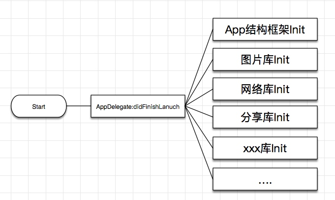
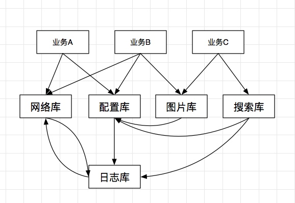
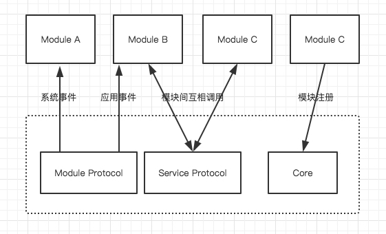
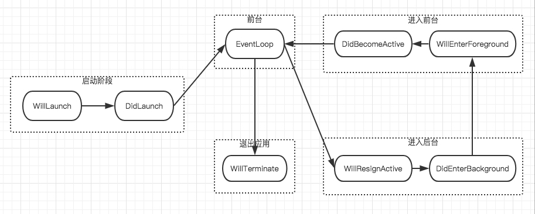
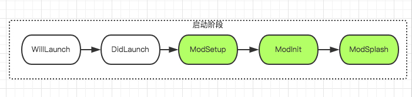
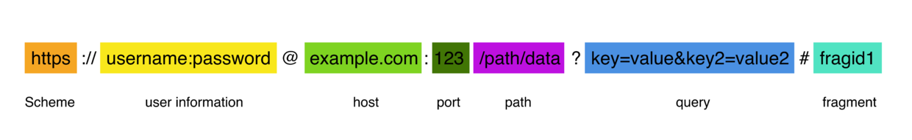
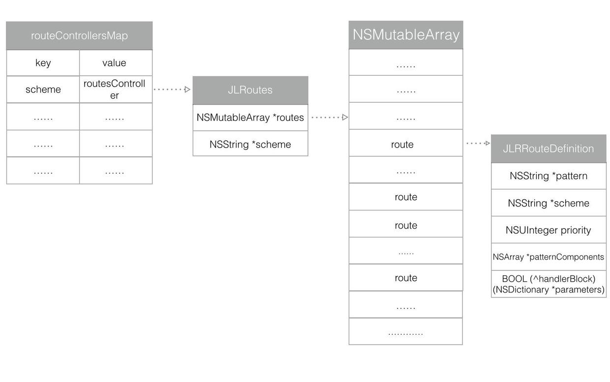
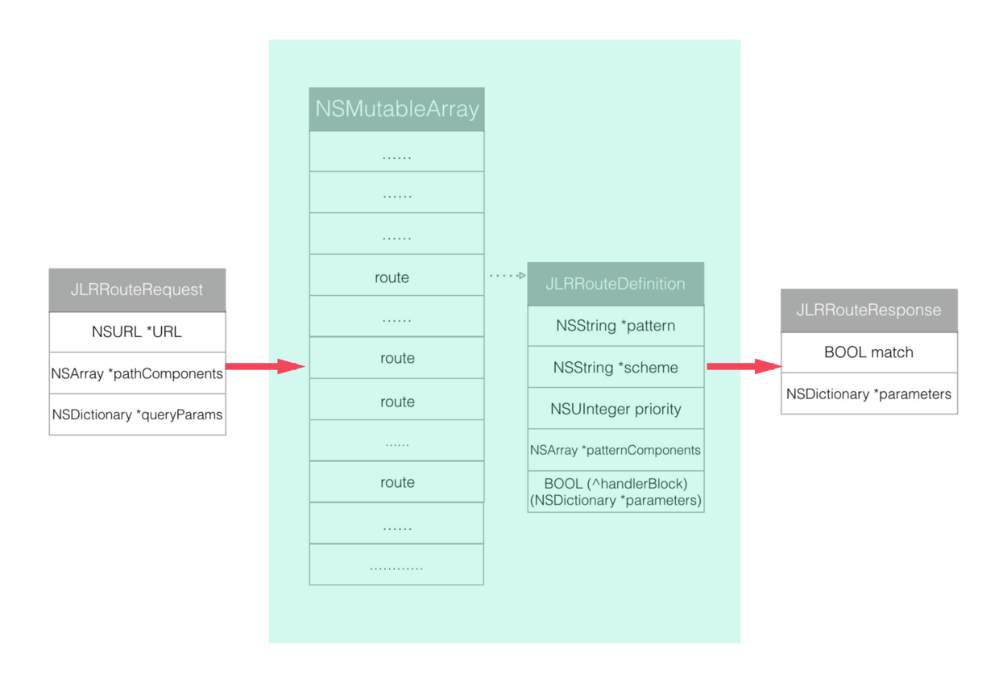
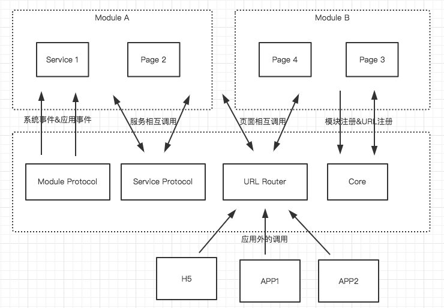
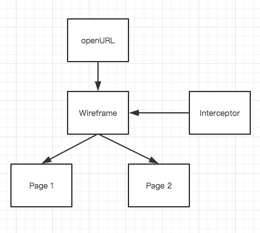

## 1.为什么要做模块化
在之前iOS的项目开发中所存在的问题    
1、`AppDelegate`中包含大量库的`init`以及其他操作，少则几百行，多则上千行，无关代码堆积在其中，维护成本极高，不同库的调用逻辑互相交错。   
    
2、面条式的耦合，导致上层业务受限于底层基础库的依赖影响，BUG排查缓慢、新功能增加效率随代码量递增而不断递减。   
   
架构从`MVC`逐渐演化变成了成`MVVM`，`VIPER`等复杂架构，同时`H5`、`ReactNative`、`Weex`等技术的出现和使用，项目架构也变得更加的复杂。如何解耦各层，解耦各个界面和各个组件，降低各个组件之间的耦合度，如何能让整个系统不管多么复杂的情况下都能保持“高内聚，低耦合”的特点，这一系列的问题都摆在开发人员面前，亟待解决。
## 2.阿里开源组件化方案`BeeHive`
`BeeHive` 是用于`iOS` 的`App`模块化编程的框架实现方案，吸收了`Spring`框架`Service` 的理念来实现模块间的`API`耦合。基本架构如下图所示:   


### 2.1.模块生命周期的事件（模块注册）
`BeeHive`会给每个模块提供生命周期事件，用于与`BeeHive`宿主环境进行必要信息交互，感知模块生命周期的变化。系统事件基本工作流如下图   

在系统事件的基础之上，扩展了应用的通用事件，例如`modSetup`、`modInit`等，可以用于编码实现各插件模块的设置与初始化。扩展的通用事件如下图   


### 2.2.模块具体实现与接口调用分离（Service注册）
然而业务模块需要相互调用，通过`Protocol`的进行依赖的解耦。`BeeHive`是通过注册绑定`Protocol`和`IMPL Class`来实现，代码如下所示：
```
[[BeeHive shareInstance] registerService:@protocol(HomeServiceProtocol) service:[BHViewController class]];  //注册绑定`Protocol`和`IMPL Class`

//通过Protocol获得调用实例
id< HomeServiceProtocol > homeService = [[BeeHive shareInstance] createService:@protocol(HomeServiceProtocol)];
```
## 3.Github的开源URL路由工具`JLRoutes`
JLRoutes是一个调用极少代码 , 可以很方便的处理不同URL schemes以及解析它们的参数，并通过回调block来处理URL对应的操作的三方库。  

### 3.1.使用URL实现统一跳转（APP之间、H5&原生、iOS&Android）
URL（Uniform Resource Locator,统一资源定位符），是通用定位资源的位置和访问方法的一种表示，包含模式（或称协议）、服务器名称（或IP地址）、路径和文件名。

### 3.2.RegisterRoute路由注册
JLRoutes全局会保存一个Map，这个Map会以scheme为Key，JLRoutes为Value。  
在每个JLRoutes里面都保存了一个数组，这个数组里面保存了每个路由规则JLRRouteDefinition里面会保存外部传进来的block闭包，pattern，和拆分之后的pattern。


```
[[JLRoutes globalRoutes] addRoute:@"/user/view/:userID" handler:^BOOL(NSDictionary *parameters) {
    NSString *userID = parameters[@"userID"]; // defined in the route by specifying ":userID"

    // present UI for viewing user with ID 'userID'

    return YES; // return YES to say we have handled the route
  }];
```

### 3.3.RouteURL查找路由
根据外部传进来的URL初始化一个JLRRouteRequest，然后用这个JLRRouteRequest在当前的路由数组里面依次request，每个规则都会生成一个response，但是只有符合条件的response才会match，最后取出匹配的JLRRouteResponse拿出其字典parameters里面对应的参数。

```
NSURL *viewUserURL = [NSURL URLWithString:@"myapp://user/view/joeldev"];
[JLRoutes routeURL:viewUserURL];
```
## 4.模块化的项目架构
模块化的项目架构，目标是做到代码的拆分，代码和逻辑的解耦，避免代码侵入来实现不同技术甚至不同平台的相互调用。
### 4.1.使用Workspace、framework、CocoaPods代码模块化管理
使用`Workspace`多`Project`的方式管理所有代码，第三方库使用`CocoaPods`管理，所有第三方库和各个模块都将打包framework，最后统一打包进`APP`。业务模块都依赖Base、Common和第三方库，业务模块之间完全隔离。


### 4.2.模块化方案（`BeeHive`&`JLRoutes`）
`BeeHive`和`JLRoutes`的封装作为模块间的中间件，负责隔离各个模块，协调相互调用和页面跳转。    

### 4.3.ModuleCore中间件

```
// 模块化相关初始化
+ (void)moduleSetupWithApplication:(UIApplication *)application options:(id)launchOptions;
// 注册模块服务
+ (void)registerService:(Protocol *)protocol service:(Class)serviceClass;
//创建模块服务实例
+ (id)createService:(Protocol *)protocol;
// 添加路由规则
+ (void)addRoute:(NSString *)routePattern handler:(BOOL (^)(NSDictionary<NSString *, id> *parameters))handler;
// 执行路由的URL
+ (BOOL)routeURL:(NSURL *)URL;
```
### 4.4.Module
```
// 模块初始化，统一注册服务，注册URL
- (void)modInit:(BHContext *)context {
    [BoBoModuleCore registerService:@protocol(BoBoShareWireframeProtocol) service:[BoBoShareWireframe class]];
    [BoBoShareWireframe setupGlobalRoutes];
}
// 接收其他事件
- (void)modSetUp:(BHContext *)context {
    NSLog(@"ShareModule setup");
}
- (void)modWillResignActive:(BHContext *)context {

}
- (void)modDidEnterBackground:(BHContext *)context {

}
```
### 4.5.ServiceProtocol（BeeHive）
通过ServiceProtocol的方式模块对外提供调用接口，从而实现模块间的调用。
```
id<BoBoShareWireframeProtocol> wireframe = [BoBoModuleCore createService:@protocol(BoBoShareWireframeProtocol)];
[wireframe showShareActionSheet:self items:nil shareParams:nil onShareStateChanged:^{

    }];
```
### 4.6.Wireframe页面路由（JLRoutes）
这一层是用统一管理页面交互，维护URL和页面的映射关系，实现了页面拦截器（借鉴了VIPER框架）。   


```
// 初始化路径映射注册，模块初始化时调用
+ (void)setupGlobalRoutes;
// 路径映射关系，需要子类重写并返回值
+ (NSDictionary *)globalRoutesMap;
// 跳转到指定页面
- (void)pushView:(NSString *)viewType
      withParams:(NSDictionary *)params
      navigation:(UINavigationController *)navigation
        animated:(BOOL)animated;
// 弹出指定页面
-(id<BoBoShareControllerProtocol>)showShareActionSheet:(UIViewController *)viewController
                                                          items:(NSArray *)items
                                                    shareParams:(NSMutableDictionary *)shareParams
                                            onShareStateChanged:(void (^)())shareStateChangedHandler
```
WireframeInterceptor拦截器
```
// 增加一个全局起效拦截器
-(void)addGlobalInterceptor:(id<BoBoWireframeInterceptorProtocol>)interceptor;
// 执行所有的拦截方法获取结果
- (void)doInterceptorWithUserInfo:(NSDictionary *)userInfo pass:(FilterHandler)pass fail:(FilterHandler)fail;
```
