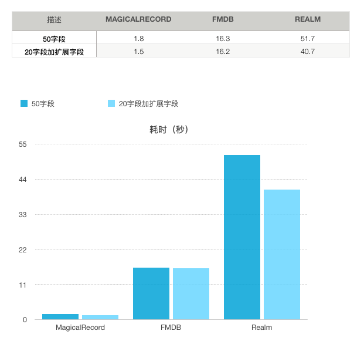
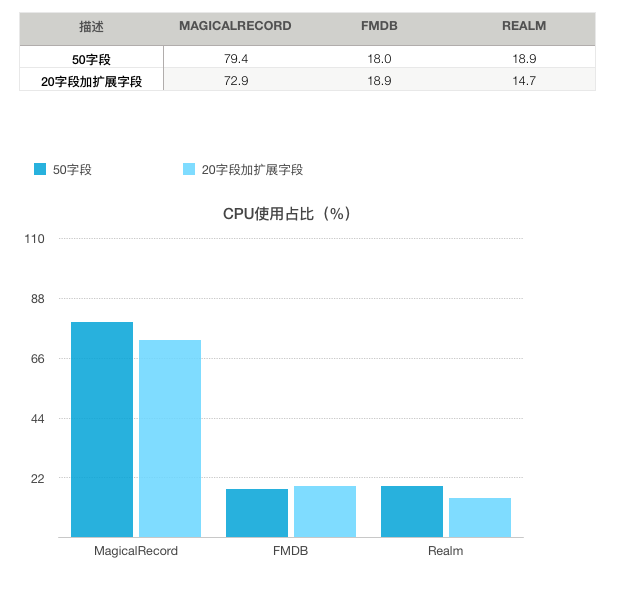
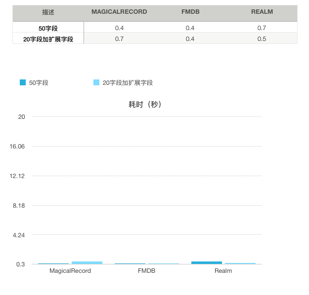
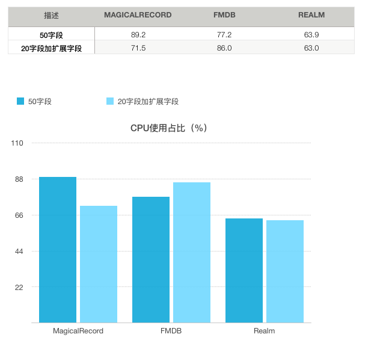
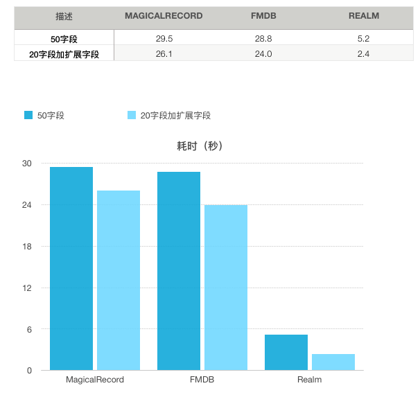
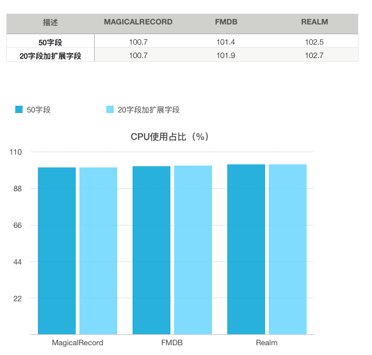
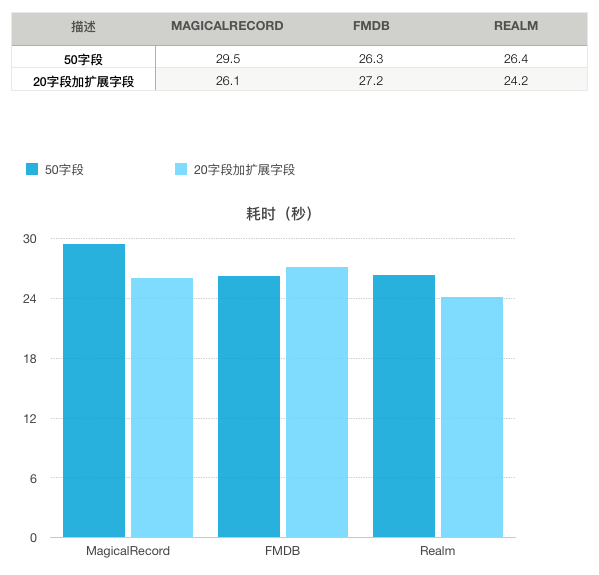
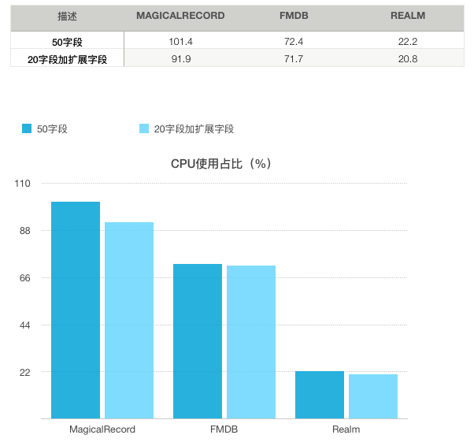

iOS持久化有很多种方式，对于大量的数据持久化必然要使用DBMS技术，当前移动平台可选DBMS技术并不多，本文将对当前流行三个的数据库进行分析评估。主要是侧重于在iOS平台上不同方式（多字段和少字段（用json字符串方式合并））性能方面的表现。文中所涉及的数据是基于以下的环境生成。  
设备：iPhone 5s   
iOS系统：10.2   
## 介绍
### MagicalRecord
Magical Record是用来操作Core Data的一个第三方工具，而Core Data则是iOS的内置框架，一个模型层的技术. Core Data 本身既不是数据库也不是数据库访问框架.相反,Core Data是一个完整的数据模型解决方案。可以理解为对持久层的封装，使得我们可以通过可视化建立数据模型,简化数据存取. Core Data不是一个 O/RM, 也不像 FMDB 是一个 SQL wrapper。  
特点：
1、学习成本非常高（即使Magical Record做了简化）  
2、可视化和Xcode结合程度高  
3、可以不使用sql语句  
4、扩展性好  
5、多线程处理不好（大部分操作需要主线程完成，会导致UI卡顿）  
### FMDB
使用 Objective-C 封装的 SQLite API 的数据库框架，SQLite是一个开源的轻型数据库，本身API是C语言实现的，在IOS上使用不便，FMDB对其进行封装，使得方便使用之外也增加了线程安全的处理。  
特点：  
1、学习成本一般   
2、完全开源   
3、需要使用sql语句   
4、扩展性好   
5、多线程处理得很好   
### Realm
由YCombinator孵化的创业团队打造，是第一个专门针对移动平台设计的数据库，Realm并不是基于Core Data，也不是基于 SQLite 所构建 ORM 的，它拥有自己的数据库存储引擎，可以高效且快速地完成数据库的构建操作。核心引擎不开源（但其承诺以后会开源）。   
特点：   
1、学习成本非常低   
2、不需要使用sql语句   
3、扩展性一般   
4、还不够完全成熟（还在发展中）   

## 单条多次插入数据性能对比   
三个数据库首次创建后抽入数据，分多字段和少字段（用json字符串方式合并）两种情况，字段的数据是随机数量的随机中文，比较性能，以下字段数据都是重复5次后获取的平均值。   
耗时（秒）：单条多次插入1000条数据的总耗时，重复5次后的平均值
   
CPU使用占比（%）：重复5次插入1000条数据时，每次插入100条数据后取样的平均值

## 批量插入数据性能对比
三个数据库首次创建后抽入数据，分多字段和少字段（用json字符串方式合并）两种情况，字段的数据是随机数量的随机中文，比较性能，以下字段数据都是重复5次后获取的平均值，由于FMDB没有做事务优化，所以批量插入性能跟单次相当，如果做sql批量插入比较麻烦，而且要考虑sql语句最长长度。   
耗时（秒）：批量插入1000条数据的总耗时，重复5次后的平均值   
  
CPU使用占比（%）：重复5次批量插入1000条数据时，每次插入1000条数据后取样的平均值

## 数据查询性能对比
三个数据库抽入5000条数据，使用条件查询一条数据，以及不使用条件获取10条数据的性能比较，以下字段数据都是重复5次后获取的平均值。  
耗时（秒）：查询1000次数据的总耗时，重复5次后的平均值
   
CPU使用占比（%）：重复5次查询一千1000次数据时，每次查询100条数据后取样的平均值

## 数据更新性能对比
三个数据库抽入5000条数据，使用条件查询一条数据，以及不使用条件获取10条数据的性能比较，以下字段数据都是重复5次后获取的平均值。   
耗时（秒）：更新1000条数据的总耗时，重复5次后的平均值
   
CPU使用占比（%）：重复5次更新1000条数据时，每次更新100条数据后取样的平均值   
   
## 总结

1. MagicalRecord数据库主要在主线完成，无论是插入、查询还是更新都有卡顿现象，暂时未找到多线程操作的方案，即使使用多线程也非常容。

1.  跟两个表的操作性能对比来说，节省字段来提升性能并没有显的作用。

1. 从插入数据的性能来说MagicalRecord最好，但CPU占用高，Realm表现最差接近是FMDB的三倍。而数据查询的话，还是Realm 有明显的优势是速度是其他2者的6、7倍，FMDB也和MagicalRecord相当。数据更新则是Realm表现最好，MagicalRecord略差。总体而言，FMDB的各方面表现比较均衡，Realm强在于查询性能好，但插入数据有明显性能问题。MagicalRecord总体来说数据插入性能最好的，coredata是做了内存缓存的优化，带来的问题就是在插入的数据在其他线程查询不到，面表现一般。

1. MagicalRecord学习曲线陡峭，不适合使用多线程，容易出错，出错后不好排查。FMDB需要写sql语句，实现的代码量较大，优势在于各方面性能均衡。Realm简单易学，代码简洁，主要的缺点还是数据插入的性能不好。
