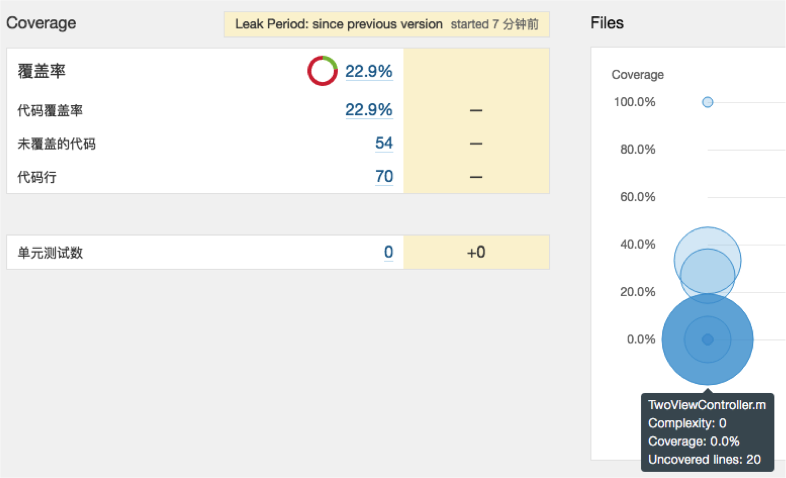

## iOS UI测试前世今生
1. instrument/UIAutomation 苹果官方最早出的一个UI测试框架，用来在真实设备和iPhone模拟器上执行自动化测试，只支持JavaScript编写脚本
1. KIF  很早之前出的一个第三方测试框架，测试代码模仿用户操作，代码很简单，使用方式简单，可扩展性不强
1. EarlGrey Google不久前开源的测试框架，功能强大，可扩展性高，非常优秀的测试框架，支持到ios8以及以上，版本还不稳定不够成熟
## UI Testing
这是WWDC15推出的一个UI测试框架，基于Accessibility，使用ObjectC/Swift，非常接近于普通的开发编程。   
特性：   
强大的界面元素查找   
检验界面元素   
支持录制的代码生成   
### 基于Accessibility
Accessibility 是苹果早就发布的一个框架，提供给有一定身体障碍（例如失明）的人使用，让他们能够操作和使用你的应用。他把你的 UI 以语义话的方式提供给这些用户，允许他们进行丰富的操作。你可以（也应该）让你的元素具备Accessibility的能力。

### XCUIApplication
继承XCUIElement，这个类掌管应用程序的生命周期，里面包含两个主要方法
```
launch(): //启动程序
terminate(): //终止程序
```
### XCUIElement
可以表示系统的各种UI元素
```
exist: //可以让你判断当前的UI元素是否存在
descendantsMatchingType(type:XCUIElementType)->XCUIElementQuery:
//取某种类型的元素以及它的子类集合
childrenMatchingType(type:XCUIElementType)->XCUIElementQuery:
//取某种类型的元素集合，不包含它的子类  
```
另外UI元素还有一些交互方法
```
tap  点击
doubleTap 双击
twoFingerTap 双指点击
pressForDuration 长按
swipeUp 向上滑动
swipeDown 向下滑动
swipeLeft 向左滑动
swipeRight 向右滑动
typeText 文本框输入信息
```
可通过读属性的方式取得某种类型的UI集合部分属性如下


### 代码Demo


### 使用xcode录制代码
打开项目的uitests代码文件，xcode下方有个红点点击就可以录制。

### 使用总结
1. 使用方式简洁明了，使用object c和swift语言容易接受
1. 局限性只能支持ios9以及以上系统版本
1. 感觉随着ios系统的升级，之后有可能会逐渐地流行起来

## Fastlane Snapshot
Fastlane Snapshot是截图测试工具，兼容UI Testing测试框架，使用配置文件进行配置使用。
### 安装
```
sudo gem install snapshot
```
### 使用
```
snapshot init
```
配置Snapfile文件，UI测试代码加入
```
[Snapshot setupSnapshot:app];
[Snapshot snapshot:
@"01LoginScreen"
waitForLoadingIndicator:YES];
```
cd到项目目录运行
```
snapshot
```


### 运行结果
运行完后的结果，生成了一个html文件和一组截图


## 集成至Jenkins和sonar
使用Jenkins定时构建测试任务，将测试结果和代码覆盖率上传至sonar。下面是主要用到命令行。
```
xcodebuild test -scheme UITestDemo -workspace UITestDemo.xcworkspace -destination "platform=iOS Simulator,name=iPhone 6s,OS=10.0" | xcpretty
```
```
slather coverage -x --output-directory sonar-reports --scheme UITestDemo --workspace UITestDemo.xcworkspace --project UITestDemo.xcodeproj
```
```
sonar-runner
```

